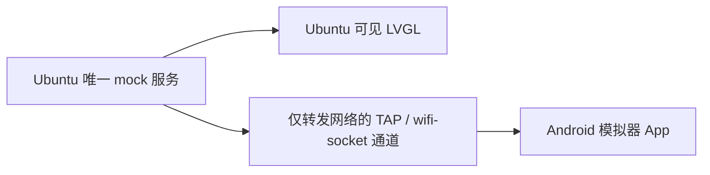

# CarLauncher

Android 和 Ubuntu 上可见的 LVGL 仪表订阅**同一个** `vehicle_mock_service`，
接收 Service `0x1111` / Instance `0x2222` / Event `0x8001` / EventGroup `0x0001`。
本页是前台双界面联调的唯一启动顺序。



## 0. 关闭旧实验

先在 Windows PowerShell 中确认设备，再关闭本次实验的模拟器：

```powershell
& D:\Android\SDK\platform-tools\adb.exe devices
& D:\Android\SDK\platform-tools\adb.exe -s emulator-5554 emu kill
```

等待该设备从列表消失。然后在旧转接器、旧 helper、旧 mock 的终端中按 Ctrl+C，
关闭旧 LVGL 窗口。先关闭模拟器再断开通道，避免 QEMU/ADB 卡住。
旧 helper 应输出 `CLEANUP_COMPLETE`；若仍提示已有 TAP/组播路由，先结束旧 helper，
不要再叠加启动一套服务。

Ubuntu 可用以下命令检查是否还留有旧实验进程：

```bash
pgrep -af 'vehicle_mock_service|socket-tap-event-probe.py|dashboard_simulator/bin/main|./bin/main'
```

## 1. Windows 终端 A：仅启动网络通道

以下 Windows 命令从 `D:\Android\AndroidStudioProjects\CarLauncher` 执行。
先同步新版脚本（首次使用或更新后执行）：

```powershell
scp .\tools\someip-probe\socket-tap-event-probe.py root@192.168.31.248:/root/develop/carlauncher-probe-20260909/
```

下面以 `socket-tap-sd-shared-01` 为本次目录。目录必须尚不存在；下次改为
`socket-tap-sd-shared-02`，并同步修改后续两个 Ubuntu 终端的 `run_dir`。

```powershell
run_dir='socket-tap-sd-shared-01'
ssh root@192.168.31.248 "cd /root/develop/carlauncher-probe-20260909 && python3 socket-tap-event-probe.py $run_dir --network-only --duration 0 --connect-timeout 1800"
```

等待 `NETWORK_ONLY` 和 `READY`。**必须带 `--network-only`**：helper 只启动 TAP、
DHCP、抓包和网络转发，生成 `MOCK_CONFIG` / `LVGL_CONFIG`，不启动 mock/LVGL。
省略该参数属于旧的隔离自动测试模式，会产生另一套数据源，不用于本页的前台联调。

## 2. Ubuntu 终端 B：启动唯一 mock 服务

用第 1 步生成的配置，使服务绑定 `10.203.0.1`。不要使用仓库根目录的
`mock-service.json`（其默认地址为 `192.168.31.248`）。

```bash
cd /root/develop/carlauncher-probe-20260909
run_dir=/root/develop/carlauncher-probe-20260909/socket-tap-sd-shared-01
env LD_LIBRARY_PATH=/root/develop/vsomeip/build \
    VSOMEIP_CONFIGURATION="$run_dir/service-sd.json" \
    ./build/vehicle_mock_service 2>&1 | tee "$run_dir/service.log"
```

该终端显示的 `MOCK_EVENT` 就是两个界面的唯一数据来源。保持运行，只启动一次。

## 3. Ubuntu 终端 C：启动可见 LVGL

在能显示窗口的 Ubuntu 桌面终端，或已启用 X11 转发的 SSH 终端中运行。
`DISPLAY` 应由当前图形会话提供，不要随意填写固定值。

```bash
cd /root/develop/dashboard_simulator
run_dir=/root/develop/carlauncher-probe-20260909/socket-tap-sd-shared-01
env -u SDL_VIDEODRIVER -u SDL_RENDER_DRIVER \
    LD_LIBRARY_PATH=/root/develop/vsomeip/build \
    VSOMEIP_CONFIGURATION="$run_dir/lvgl-client.json" \
    VEHICLE_EVENT_UI_TRACE=1 \
    ./bin/main 2>&1 | tee "$run_dir/lvgl.log"
```

必须使用与 mock **同一 `run_dir`** 的配置。它们的 `network` 和 `unicast` 相同，
LVGL 的 routing 指向唯一的 `vehicle-mock-service`。不要用旧的
`config/lvgl-client.json`，也不要加 `SDL_VIDEODRIVER=dummy`，否则无法得到这套可见界面。

## 4. Windows 终端 D：前台启动有窗口的模拟器

```powershell
& D:\Android\SDK\emulator\emulator.exe -avd Automotive_1408p_landscape -no-audio -no-snapshot -feature -WiFiPacketStream -wifi-socket listen=127.0.0.1:37493
```

不要加 `-no-window`。Android Studio 默认启动模拟器不带这里的 `-wifi-socket` 参数，
因此先执行此命令，再让 Android Studio 选择这个已经在线的设备。

## 5. Windows 终端 E：连接转接器

```powershell
.\tools\someip-probe\socket-tap-forward.ps1 -DurationSeconds 0
```

等待 `CONNECTED`。两端时长均为 0，连接后持续运行到主动关闭；
helper 在首次连接前最多等待 1800 秒。所有上述终端保持运行。

## 6. Windows 终端 F：检查网络并运行 App

```powershell
& D:\Android\SDK\platform-tools\adb.exe devices
& D:\Android\SDK\platform-tools\adb.exe -s emulator-5554 shell getprop sys.boot_completed
& D:\Android\SDK\platform-tools\adb.exe -s emulator-5554 shell ip -4 addr show wlan0
```

分别应看到 `device`、`1`、`10.203.0.2`。在 Android Studio 选择该设备，
执行 **app → Run**，然后在 App 中点击 **START RECEIVE**。
收到 Event 后显示 `SOME/IP ONLINE`。观察界面不需要执行 `connectedDebugAndroidTest`。

## 确认两个界面来自同一发布器

- Ubuntu 终端 B：`MOCK_EVENT` 的 `seq` 和 `speedKph`。
- Ubuntu 终端 C：`LVGL_EVENT` / `LVGL_UI` 的同一 `seq` 和速度。
- Android Logcat（过滤 `tag:VEHICLE_SERVICE`）：`VEHICLE_EVENT` 的同一 `seq` 和速度。

两个 UI 的刷新时刻不必完全一致，核对同一个 seq 的数据。
若序列相差成千上万，先检查是否有旧 mock/LVGL 进程，或是否误用了旧配置。
每个 mock 进程独立从 1 开始计数；重启唯一 mock 后 seq 会重新计数。

默认 mock 每 100 ms 持续发布，不注入非法数据或静默。要测试故障，在第 2 步的
`./build/vehicle_mock_service` 后显式加 `--fault-cycle`：此时 `seq % 1200` 为
600–699 时数据越界、700–999 时静默约 30 秒、1000 起恢复。
服务会打印 `MOCK_PHASE SILENT` / `MOCK_PHASE RESUMED`。故障模式下静默期间
`EVENT_TIMEOUT` 是预期现象，不能据此判定订阅造成死锁。
Android 与 LVGL 对非法数值的显示方式不同（如原始值与 `--`），应对照日志中的完整帧。
跨机器时间戳未经校准不能直接用来测量毫秒级网络延迟。

## 停止顺序

1. App 点击 STOP RECEIVE，关闭可见 LVGL，在唯一 mock 的终端按 Ctrl+C。
2. 执行 `adb -s emulator-5554 emu kill` 关闭模拟器。
3. 等转接器和 helper 清理退出；必要时 Ctrl+C。

`--network-only` 模式下手动启动的 mock/LVGL 由各自终端管理，helper 不会代为停止。
看到 `FORWARDER_CLOSED` / `CLEANUP_COMPLETE` 表示网络已结束，需按上述顺序重新启动。

编译及协议参考：[MOCK_EVENTS.md](tools/someip-probe/MOCK_EVENTS.md)。
