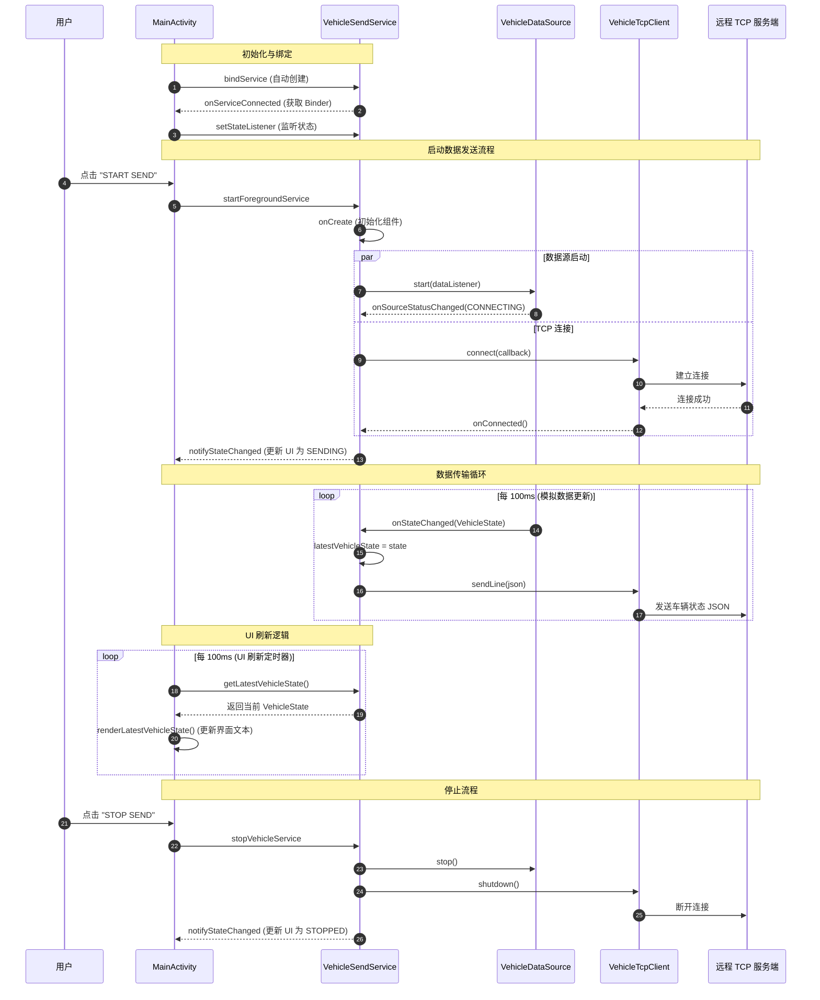

# CarLauncher

车载启动器项目，负责采集车辆状态数据并通过 TCP 协议发送至 LVGL 等显示终端。

## 项目核心时序图

```mermaid
sequenceDiagram
    autonumber
    participant User as 用户
    participant MA as MainActivity
    participant VSS as VehicleSendService
    participant VDS as VehicleDataSource
    participant VTC as VehicleTcpClient
    participant Server as 远程 TCP 服务端

    Note over MA, VSS: 初始化与绑定
    MA->>VSS: bindService (自动创建)
    VSS-->>MA: onServiceConnected (获取 Binder)
    MA->>VSS: setStateListener (监听状态)

    Note over MA, Server: 启动数据发送流程
    User->>MA: 点击 "START SEND"
    MA->>VSS: startForegroundService
    VSS->>VSS: onCreate (初始化组件)

    par 数据源启动
        VSS->>VDS: start(dataListener)
        VDS-->>VSS: onSourceStatusChanged(CONNECTING)
    and TCP 连接
        VSS->>VTC: connect(callback)
        VTC->>Server: 建立连接
        Server-->>VTC: 连接成功
        VTC-->>VSS: onConnected()
    end

    VSS-->>MA: notifyStateChanged (更新 UI 为 SENDING)

    Note over MA, Server: 数据传输循环
    loop 每 100ms (模拟数据更新)
        VDS->>VSS: onStateChanged(VehicleState)
        VSS->>VSS: latestVehicleState = state
        VSS->>VTC: sendLine(json)
        VTC->>Server: 发送车辆状态 JSON
    end

    Note over MA, VSS: UI 刷新逻辑
    loop 每 100ms (UI 刷新定时器)
        MA->>VSS: getLatestVehicleState()
        VSS-->>MA: 返回当前 VehicleState
        MA->>MA: renderLatestVehicleState() (更新界面文本)
    end

    Note over MA, Server: 停止流程
    User->>MA: 点击 "STOP SEND"
    MA->>VSS: stopVehicleService
    VSS->>VDS: stop()
    VSS->>VTC: shutdown()
    VTC->>Server: 断开连接
    VSS-->>MA: notifyStateChanged (更新 UI 为 STOPPED)
```
