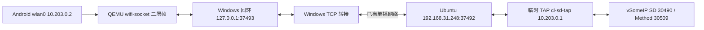

# 已验证：利用现有 TCP 通路接通 SOME/IP-SD

## 结果

2026-09-10，原有 `VsomeipNativeProbeTest#discoversServiceAndExchangesMethods` 在临时二层通道上通过，Gradle 退出 0，用时 10 秒。没有修改 Android 生产代码或测试断言；客户端没有静态远端服务条目。

- Android 发出 2 个组播 Find；Ubuntu 发出 150 个组播 Offer 和 2 个单播 Offer。
- 两轮共 8 个 Method Request / 8 个 Response，返回码为 `00,01,01,00` 重复两轮。
- native 提交 8 次、接受响应 8 次；原始抓包 182 包，内核丢包 0。
- Android 自动通过 DHCP 获得 `10.203.0.2/24`，Ubuntu 临时 TAP 为 `10.203.0.1/24`。

统一证据：[summary-zh.html](../evidence/20260910-multicast-path/summary-zh.html)。原始记录及完整矩阵：[README](../evidence/20260910-multicast-path/README.md)。

## TCP 为什么原来无需额外网络配置

现有 `VehicleTcpClient` 连接 `192.168.31.248:19090`。模拟器原地址是 `10.0.2.16`，Windows 有线地址是 `192.168.31.85`，Ubuntu ens33 是 `192.168.31.248`。此前成功的 UDP Method 抓包也看到 NAT 后源地址 `192.168.31.85`。

这条单播连接由模拟器用户态网络做地址转换，回复沿已建立的连接返回。它不要求把 Android 的组播成员关系传播到外部局域网。Android 官方说明模拟器可处理出站 TCP/UDP，但不支持 IGMP；36.5 之后模拟器之间共享虚拟 Wi-Fi，不等于自动桥接到外部局域网。[官方网络说明](https://developer.android.com/studio/run/emulator-networking-address)、[模拟器互联说明](https://developer.android.com/studio/run/emulator-networking-interconnect)。

本轮独立套接字诊断证明 Windows 与 Ubuntu 的物理网段能双向传 `224.244.224.245:37090`：Windows 收到 119 个 Ubuntu 标记，Ubuntu 收到 115 个 Windows 标记（含链路重复，不等于独立消息数）。仅通过 `IP_MULTICAST_IF` 指定各自有线地址，没有改系统路由。

Ubuntu 原先 `ip route get 224.244.224.245` 指向 VPN `tun0`。把此组播组指到 ens33 只能解决 Ubuntu 出接口；旧证据已证明它不能独自接通模拟器边界。

## 本次可行拓扑



TCP 外层承载完整以太网帧；内层仍是真实 DHCP、SD 组播和 SOME/IP UDP。没有把 SOME/IP 消息改为 TCP JSON，也没有由转接器伪造 Offer 或响应。客户端从真实 Offer 学到 `10.203.0.1:30509`。

可复现的是 Windows 模拟器 `-wifi-socket listen=127.0.0.1:37493` 模式。直接 `connect=192.168.31.248:37492` 和 `connect=127.0.0.1:37493` 在本机 QEMU 36.6.11 都报 `Resource temporarily unavailable`，故采用普通 .NET TCP 客户端主动连接 QEMU 监听端与 Ubuntu。

## 启动步骤（Windows PowerShell，项目根目录）

前提：Ubuntu 上已有本项目 probe 二进制、vSomeIP build 库、Python3、dnsmasq 和 tcpdump；当前模拟器业务处于空闲状态。若要从头使用新实验目录，给脚本传一个尚不存在且以 `socket-tap-sd-` 开头的名字。脚本拒绝覆盖旧证据或替换已有同名接口/精确组播路由。

1. 在第一个终端运行 Linux 限时 TAP、DHCP、SD 服务与抓包，等出现 READY：

```powershell
Get-Content -Raw .\tools\someip-probe\socket-tap-sd-probe.py |
  ssh -o BatchMode=yes -o StrictHostKeyChecking=yes root@192.168.31.248 'python3 - socket-tap-sd-next-run'
```

该脚本最长 420 秒，临时接口 `cl-sd-tap`，TCP 监听仅绑定 `192.168.31.248:37492` 且只接收来自当前 Windows `192.168.31.85` 的连接。IPv4 子网 `10.203.0.0/24` 与精确组播组路由由脚本建立和回收。dnsmasq 仅提供该接口 DHCP，不提供 DNS 服务。

2. 在另一个终端停止空闲模拟器并以实验模式启动（等待旧进程退出后执行启动命令）：

```powershell
& 'D:\Android\SDK\platform-tools\adb.exe' emu kill
& 'D:\Android\SDK\emulator\emulator.exe' -avd Automotive_1408p_landscape `
  -no-window -no-audio -no-snapshot -feature -WiFiPacketStream `
  -wifi-socket listen=127.0.0.1:37493
```

3. 在第三个终端运行 TCP 转接（最长 360 秒，连接关闭即清理）：

```powershell
.\tools\someip-probe\socket-tap-forward.ps1
```

4. 等待启动完成，确认 `adb shell ip -4 addr show wlan0` 为 `10.203.0.2`，执行原有 SD 探针：

```powershell
.\gradlew.bat :app:connectedDebugAndroidTest --offline `
  '-Pandroid.testInstrumentationRunnerArguments.class=com.example.carlauncher.someip.VsomeipNativeProbeTest#discoversServiceAndExchangesMethods' `
  '-Pandroid.testInstrumentationRunnerArguments.someipSd=true' `
  '-Pandroid.testInstrumentationRunnerArguments.someipLocal=10.203.0.2'
```

5. 测试结束关闭实验模拟器，TCP 断开会触发 Linux helper 的 finally 清理；随后按原参数重启：

```powershell
& 'D:\Android\SDK\platform-tools\adb.exe' emu kill
# 等旧 QEMU 退出后恢复默认网络：
& 'D:\Android\SDK\emulator\emulator.exe' -avd Automotive_1408p_landscape -no-window -no-audio
```

## 已恢复与适用范围

本轮已恢复 Android `10.0.2.16`；Linux 没有残留 `cl-sd-tap`、`10.203.0.0/24`、该组播精确路由、37492/30490/30509 测试监听或测试进程。默认路由、VPN、ens33/ens37 和防火墙未改。

此方案需要 **Ubuntu 上一个自动创建的临时网络接口**，不是完全零系统网络操作；Android 与 Windows 不需添加系统路由。临时网段没有互联网转发，仅用于与该 Ubuntu vSomeIP 服务联调。默认模拟器 NAT 模式的外部组播并没有因此自动修好。

脚本地址按当前主机写定，换机器应更新 Windows 源 IP、Ubuntu 入口 IP、测试子网和服务目录后重新验证。仍未证明长期稳定性、性能/时延、跨机器通用性、真实车载网络或生产部署；此前 Service 生命周期和本轮 SD 发现是不同验收项。
