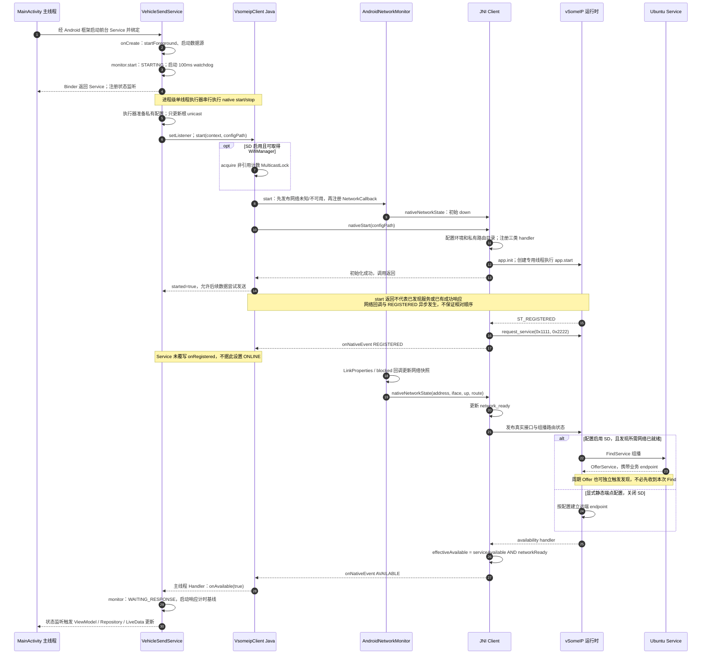
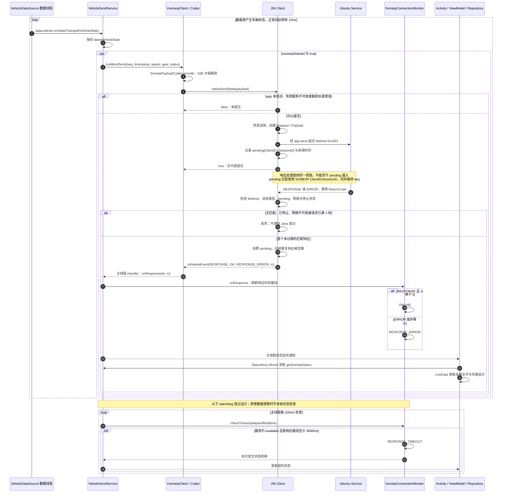
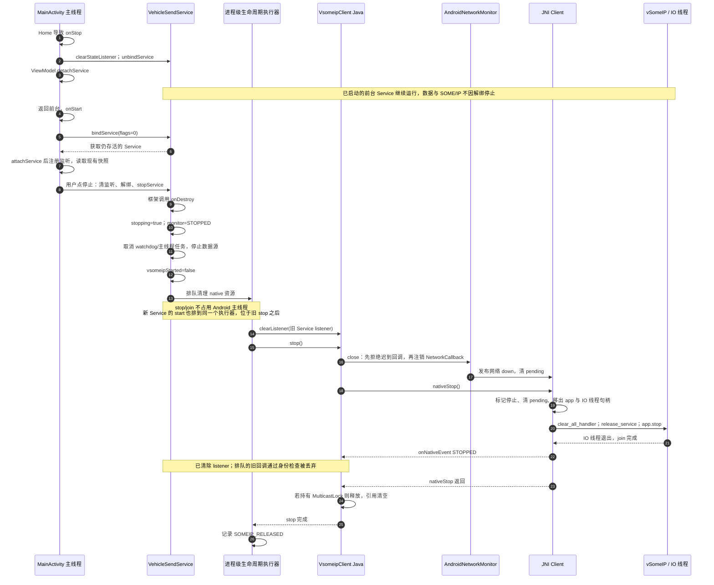

# Android SOME/IP 时序图

按 2026-09-14 当前代码整理。Android 是 Client 和车辆数据发送方，Ubuntu 是 Service。Mermaid 代码可直接在 Obsidian 阅读视图渲染。

服务 `0x1111`，实例 `0x2222`，Method `0x1001`（SetVehicleState）；请求载荷为 16 字节、大端编码。SD 使用 `224.244.224.245:30490`，当前联调服务的 Method 使用 UDP 30509。

## 1. 启动与服务发现

网络观察器只判断配置地址对应的接口、阻塞状态和路由，不能证明外部组播互通。图中主成功路径假设最终有效可用性为 true；false 会进入 UNAVAILABLE。静态端点模式下的 available 也不是业务成功证据。

## 2. 数据发送、响应匹配与超时

图中的 `app.send → Ubuntu` 表示逻辑请求链路，实际收发由 vSomeIP 异步完成，多个请求可同时 pending；10Hz 不会等待上一个请求响应。

两个 3 秒机制不同：

- **JNI 请求有效期**：限制每个 ClientID/SessionID 的响应接收窗口；发送时清理旧项，收到响应时再次检查，不会逐个向 Java 抛出超时事件。
- **Service 响应健康计时**：从首次 AVAILABLE 或最近一次有效匹配响应开始，3 秒没有新的响应才进入 RESPONSE_TIMEOUT。成功和错误响应都会刷新基线，重复 AVAILABLE 不延长基线。并非任意单个请求丢失就令 UI 超时。

启动配置读取/解析异常、native 加载或启动失败、执行器调度失败会进入 START_FAILED。丢失网络或服务可用性会进入 UNAVAILABLE，pending 在网络 down 时清空；恢复可用性先回到 WAITING_RESPONSE。

## 3. 后台解绑、恢复绑定与资源释放

重复 native stop 在 app 已为空时直接返回；`MulticastLock` 只有非空且持有时才实际释放。现有“SD multicast lock released”日志在 stop 的 finally 中输出，因此不能只数该日志来统计实际释放次数。

## 阅读与源码对应

| 图中角色 | 当前实现 |
| --- | --- |
| 页面绑定、停止、后台与恢复 | `MainActivity.java` 的 onStart、onStop、serviceConnection、stopVehicleService |
| 生命周期执行器、数据发送、watchdog | `VehicleSendService.java` 的 SomeipLifecycle、runVsomeipStart、dataListener、someipWatchdog、onDestroy |
| 配置、网络观察器、组播锁与主线程回调 | `VsomeipClient.java` 的 start(Context, String)、stop、onNativeEvent |
| 地址与路由监测 | `AndroidNetworkMonitor.java`、`NetworkStateTracker.java` |
| 请求关联、响应去重、运行时启停 | `app/src/main/cpp/carlauncher.cpp` |
| 独立 SOME/IP 状态 | `SomeipConnectionMonitor.java` |
| UI 读取 Service 快照 | `VehicleRepository.java`、`CockpitViewModel.java` |

以上为代码结构图，没有重新执行联调测试。此前 9 月 10 日已分别验证真实 Service 生命周期，以及 socket/TAP 拓扑下的 SD 发现和 Method；两者不是一次联合测试。TCP 二层转接改变底层网络路径，不改变上述 Java/JNI 业务调用顺序。
