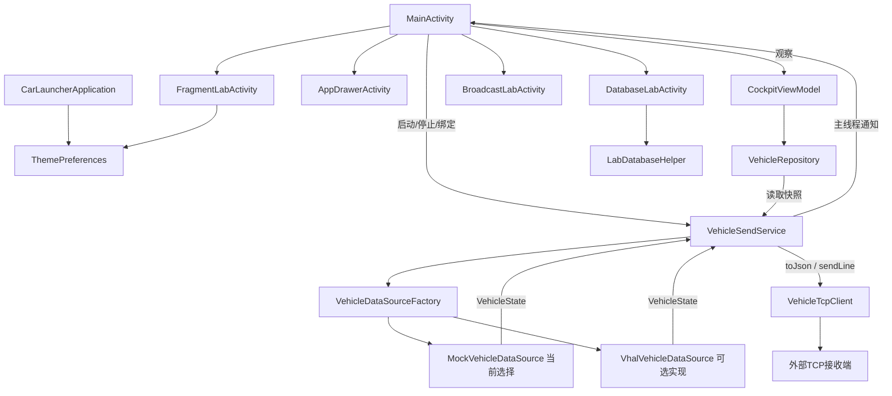
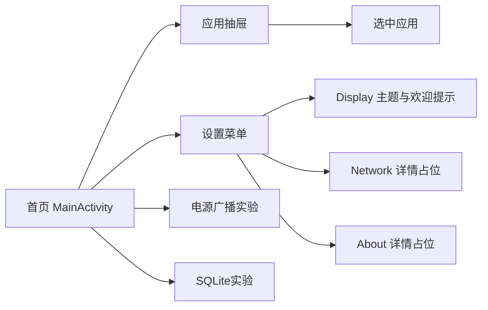
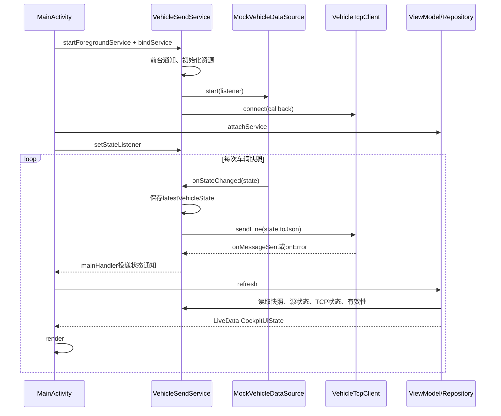
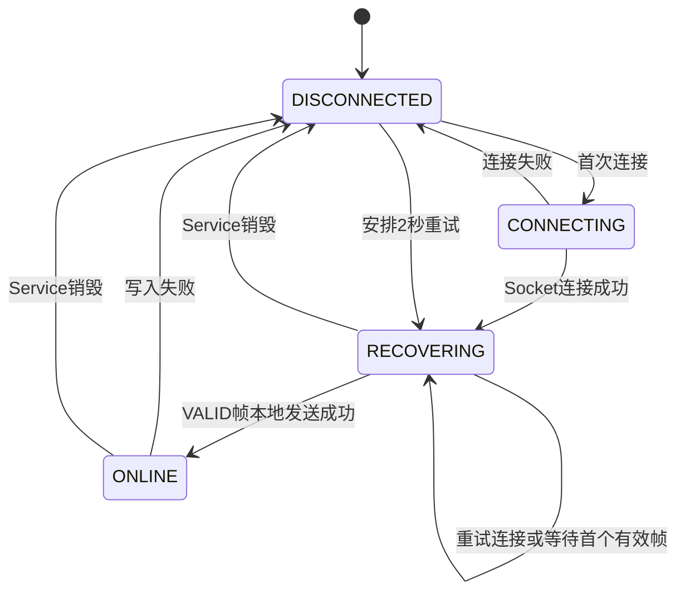

# CarLauncher 车机程序设计文档

## 1. 文档范围

本文描述当前工作目录 `D:\Android\AndroidStudioProjects\CarLauncher` 中 Android 程序的结构、页面、数据模型、生命周期、通信及本地存储设计，供后续维护、开发和学习复盘使用。

编写依据为当前工作树源码，基准提交为 `e2e4c66`。学习计划只提供产品背景；功能是否存在、接口如何调用，以本工程实际代码为准。本文未进行编译、设备运行或测试重跑，“已有实现”不等于本次运行验收通过。

当前程序定位为：**带车辆状态面板、应用抽屉和 Android 能力实验页面的车机应用**。Manifest 只有 MAIN/LAUNCHER 入口，尚未声明 HOME，因此当前不是系统默认桌面候选。外部接收端仅作为 TCP 输出依赖，本文不设计 Ubuntu/LVGL 系统。

## 2. 程序功能组成

| 功能 | 当前实现 | 主要入口 |
|---|---|---|
| 车辆首页 | 展示车速、档位、转速、电量、转向、驻车、门锁、温度、告警、有效性和序号 | MainActivity |
| 发送控制 | 启动/停止前台 Service，展示发送与恢复状态 | 首页 START SEND / STOP SEND |
| 应用抽屉 | 查询可启动 Activity，三列展示图标和名称，点击启动 | AppDrawerActivity |
| 设置 | Display/Network/About 菜单；Display 支持主题、欢迎提示、恢复默认 | FragmentLabActivity |
| 广播实验 | 展示电源接入/断开事件 | BroadcastLabActivity |
| 数据库实验 | name/value/note 记录新增、查询、更新、按名称删除 | DatabaseLabActivity |
| 车辆数据源 | Mock 和 VHAL 两种实现；当前 Service 固定使用 Mock | VehicleDataSourceFactory |
| 网络输出 | UTF-8 NDJSON，经 TCP 异步发送并自动重连 | VehicleTcpClient |

Network/About 目前是详情容器入口，未实现服务器配置和完整关于页业务。当前没有独立通信诊断页、车辆告警历史页、真实导航/媒体/电话、JNI 或 vSomeIP 实现。

## 3. 技术与工程结构

| 项目 | 当前配置 |
|---|---|
| 应用 ID / namespace | com.example.carlauncher |
| 应用版本 | versionCode=1，versionName=1.0 |
| 模块 | 单一 app 模块 |
| 业务语言 | Java；Gradle 使用 Kotlin DSL |
| Java 编译兼容级别 | sourceCompatibility/targetCompatibility=Java 11 |
| SDK | minSdk=24，targetSdk=36，compileSdk=36.1 |
| Android Gradle Plugin | 9.3.1（版本目录声明） |
| UI | XML、ViewBinding、AppCompat、Material、ConstraintLayout、RecyclerView、Fragment |
| 状态观察 | ViewModel、LiveData |
| 本地存储 | SharedPreferences、SQLiteOpenHelper |
| 并发 | Handler、ExecutorService、ScheduledExecutorService、volatile、原子变量 |
| 车辆 API 编译依赖 | 本地 SDK optional/android.car.jar，以 compileOnly 引用 |

Java 编译级别不等于运行 Gradle 的 JDK 版本；运行 JDK 应以实际构建环境为准。minSdk 和 optional Automotive 特性声明也不等于全部 VHAL API 已在所有设备兼容验证。

```text
app/src/main/
├── AndroidManifest.xml
├── java/com/example/carlauncher/
│   ├── CarLauncherApplication.java
│   ├── MainActivity.java
│   ├── AppDrawerActivity.java
│   ├── FragmentLabActivity.java
│   ├── SettingsMenuFragment.java / SettingsDetailFragment.java
│   ├── BroadcastLabActivity.java / DatabaseLabActivity.java
│   ├── ThemePreferences.java
│   ├── ui/       CockpitViewModel、CockpitUiState、CockpitConnectionState
│   ├── service/  VehicleSendService、TcpConnectionState
│   ├── network/  VehicleTcpClient
│   ├── data/     数据源接口、工厂、Repository、协议常量及状态枚举
│   │   ├── mock/  MockVehicleDataSource
│   │   ├── vhal/  VhalVehicleDataSource
│   │   └── local/ LabDatabaseContract、LabDatabaseHelper
│   └── model/    VehicleState、Validator、车辆枚举、AppInfo、AppAdapter
└── res/          页面布局、sw600dp布局、主题、文案和状态背景
```

## 4. 总体架构



当前分层不是 Repository 直接管理数据源：**Service 是车辆状态与网络资源的持有者，Repository 是面向页面的状态适配层**。MainActivity 同时承担绑定 Service、注册监听和渲染职责；ViewModel 包装 Repository，对外暴露 LiveData。

| 类 | 核心责任 | 生命周期持有者 |
|---|---|---|
| CarLauncherApplication | 应用进程启动时应用已保存主题 | Android 进程 |
| MainActivity | UI、导航、权限请求、Service绑定桥接 | Activity |
| CockpitViewModel | 暴露状态，转发attach/detach/refresh | ViewModelStore |
| VehicleRepository | 读取Service并构造CockpitUiState | ViewModel |
| VehicleSendService | 数据源启停、最新快照、TCP状态、重连、前台通知 | Android Service |
| VehicleDataSource | 统一数据产生接口 | Service |
| VehicleTcpClient | 串行连接、写入与关闭Socket | Service |
| VehicleState | 保存一次车辆状态，提供JSON序列化 | 各消费方持有快照 |

## 5. 页面与交互设计

### 5.1 页面导航



### 5.2 车辆首页

`activity_main.xml` 使用 ConstraintLayout 外框，上部为64dp工具栏，下部为横向三栏。根容器按系统栏 Insets 加24dp内边距；布局面向学习计划中的1408×792主屏，但本次没有重新检查实际显示效果。

- 顶栏：时间文本、Cockpit Hub 标题、数据源状态、连接状态、发送按钮。
- 主体：车辆状态区、速度等核心仪表信息及操作入口。
- 数值区：speed、gear、rpm、soc、turnSignal、parkingBrake、warning、validity、seq，以及可空门锁/温度/EV电量。
- 点击发送按钮前读取 CockpitUiState，只有 actionEnabled=true 才执行；stopAction 决定停止或启动 Service。
- 首页通过显式 Intent 打开抽屉、设置、广播和数据库页面。

没有VehicleState时显示`-- km/h`、`-`、`NO DATA`等占位；可空字段显示`--`。存在快照时按快照原值渲染，包括无效车速值，同时显示validity；当前没有按无效性统一遮蔽数值的策略。

时间控件当前XML值为`09:30`，MainActivity未实现时钟刷新；“最后更新”显示`Updated · Seq ...`，不是实际时间或数据年龄。sourceStatusText渲染的是CONNECTED/NO_DATA等源状态，而非持续显示MOCK/VHAL名称。

### 5.3 应用抽屉

AppDrawerActivity以ACTION_MAIN+CATEGORY_LAUNCHER查询PackageManager，排除本应用，为每个返回Activity建立AppInfo（名称、包名、图标、显式启动Intent），由AppAdapter展示。RecyclerView使用三列GridLayoutManager。

点击后启动显式Intent；空Intent或ActivityNotFoundException以Toast提示失败。列表是系统查询返回的可见可启动Activity集合，不应解释为设备全部安装包清单。页面另保留计数按钮和savedInstanceState实验代码，属于学习辅助功能。

### 5.4 设置页

FragmentLabActivity实现SettingsMenuFragment的选择回调。通过是否存在detail_container判断单双栏：普通布局用一个容器，`layout-sw600dp`提供双栏。

- 单栏：详情替换菜单容器，加入Fragment返回栈，详情返回按钮popBackStack。
- 双栏：菜单与详情同时存在，首次默认Display，详情返回按钮隐藏。
- 点击采用500ms防抖，并忽略与selectedTitle相同的选择。
- 首次创建才安装初始Fragment，配置重建交由FragmentManager恢复。
- SettingsDetailFragment用arguments保存标题，onDestroyView释放ViewBinding及监听器。

Display包含主题Spinner、欢迎提示Switch、恢复默认按钮。初始化先恢复保存值再注册监听，减少初始化触发误写。主题改变通过AppCompatDelegate应用；恢复默认先同步控件，再应用主题。

### 5.5 实验页面

BroadcastLabActivity动态订阅ACTION_POWER_CONNECTED和ACTION_POWER_DISCONNECTED，在onStart注册、onStop注销，通过TextView和Logcat显示事件。它目前不承担网络变化监控或Service重连触发。

DatabaseLabActivity提供name/value/note输入与CRUD按钮，展示执行结果和记录文本。它是通用SQLite实验页面，没有自动接入车辆告警事件。

## 6. 数据模型设计

### 6.1 VehicleState

VehicleState由Builder构建，成员使用final，不提供修改器；生成后作为只读快照共享。数据源持有可变生成状态，每次发布新对象，避免UI读取正在修改的Builder。

| Java字段 | 类型 | JSON键 | 当前处理 |
|---|---|---|---|
| version | int | version | Mock设0，VHAL设1 |
| sequence | long | seq | 数据源递增，用于日志对齐 |
| timestampMs | long | timestampMs | System.currentTimeMillis生成 |
| vehSpeedKph | int | speedKph | 原值保留，构造器不钳制 |
| engRpm | int | rpm | 原值保留，构造器不钳制 |
| gear | Gear | gear | 构造时null回退P；序列化getValue |
| soc | int | soc | 构造时钳制到0～100 |
| turnSignal | TurnSignal | turnSignal | null回退NONE；序列化getValue |
| parkingBrake | boolean | parkingBrake | 驻车制动状态 |
| warning | WarningState | warning | null回退NONE；序列化getValue |
| validity | DataValidity | validity | null回退INCOMPLETE；序列化整数值 |
| doorLock / beltWarning | Boolean | 同名 | 可空；beltWarning=true表示未系告警 |
| headlightsState / highBeamLightsState | Integer | 同名 | 可空灯光状态 |
| engineCoolantTemp / evBatteryLevel | Float | 同名 | 可空原始字段 |
| dataStatus | DataStatus | dataStatus | 非null才显式写入 |

可空字段直接传给JSONObject.put，代码没有统一写入JSONObject.NULL的策略，消费方不能要求所有可选键一定存在。VHAL把EV_BATTERY_LEVEL原始Float直接写入模型，而UI按百分比显示；属性单位与百分比转换仍需核对，不能据显示格式认定已经完成换算。

### 6.2 有效性与状态枚举

| 类型 | 值 | 用途 |
|---|---|---|
| DataValidity | VALID(0)、INVALID_SPEED(1)、INCOMPLETE(2)、STALE(3) | 快照有效性 |
| DataStatus | NORMAL(0)、INVALID(1)、NO_DATA(2)、SOURCE_DISCONNECTED(3)、TRANSPORT_DISCONNECTED(4) | 报文数据质量标签 |
| DataSourceStatus | STOPPED、CONNECTING、CONNECTED、NO_DATA、DISCONNECTED、ERROR | 数据源运行状态 |
| TcpConnectionState | DISCONNECTED、CONNECTING、RECOVERING、ONLINE | TCP生命周期 |
| CockpitConnectionState | ONLINE、CONNECTING、INVALID_DATA、DISCONNECTED、RECOVERING | 页面状态和按钮规则 |

VehicleStateValidator当前只校验车速与gear：NaN/Infinity或四舍五入后不在0～200范围返回INVALID_SPEED，gear为空返回INCOMPLETE，否则VALID。它不是全字段验证器。

VehicleProtocol提供speed 0～200、rpm 0～20000、soc 0～100的辅助判断。rpm范围与早期计划的0～8000不同，且Validator目前不调用rpm校验；设计维护应以实际调用链而非常量注释判定行为。

## 7. 数据源设计

### 7.1 统一接口

```java
public interface VehicleDataSource {
    void start(Listener listener);
    void stop();
    boolean isRunning();

    interface Listener {
        void onStateChanged(VehicleState state);
        void onSourceStatusChanged(DataSourceStatus status);
        void onError(Exception exception);
    }
}
```

接口不保证主线程回调。Factory在sourceType=VHAL时创建VhalVehicleDataSource，其他情况创建MockVehicleDataSource。当前Service在onCreate显式传入SourceType.MOCK，尚无用户配置切换。

### 7.2 Mock数据源

使用单线程ScheduledExecutorService，scheduleWithFixedDelay以100ms延迟生成快照。由于每轮执行后再延迟，实际周期包含处理时间，10Hz是名义频率。

- 正常速度每次增减2，在0～100之间往复；0为P，其他为D。
- 转速静止为800，否则800+speed×25；SOC正常为70，温度为90。
- 转向、远光、门锁、驻车和告警按seq周期切换。
- `seq % 1200`落在600～699时注入speed=255、rpm=9999、soc=150、温度=-999，标记INVALID。
- 700～999停止车辆快照回调，进入NO_DATA；1000恢复CONNECTED和数据发布。
- SOC=150经过VehicleState构造后变100，而evBatteryLevel仍可保留150；故障注入不等于所有字段原样发出。

stop关闭调度器、清空监听器并通知STOPPED。代码包含可注入调度器的包级构造，供单元测试控制时间。

### 7.3 VHAL数据源

通过Car/CarPropertyManager订阅属性，优先使用显示车速，否则使用物理车速；核心车速订阅失败记ERROR，非核心属性失败记录日志并继续。

订阅范围包含档位、转向、驻车、灯光、冷却液温度、EV电量、门锁、安全带。车速由m/s乘3.6并取整，安全带扣紧值取反映射为告警。rpm通过车速估算，soc固定70，不能把这两个字段描述为真实传感器读数。

每次有效属性变化缓存并尝试发布快照；没有车速不发布。watchdog每500ms检查一次最近车速的墙钟时间，超过3000ms设置源状态NO_DATA，但不生成STALE快照。停止时取消订阅、关闭watchdog、断开Car并清理速度缓存。

VHAL路径存在于代码中，实际属性权限、设备支持与运行结果需专项验证。

## 8. Service、状态传播与生命周期

### 8.1 正常数据流



当前UI由Service事件通知驱动，不是旧README时序图中的Activity每100ms轮询。Repository使用MutableLiveData.setValue，当前Activity和Service主线程通知路径满足该调用方式。

### 8.2 生命周期规则

| 事件 | 当前行为 |
|---|---|
| Application.onCreate | 应用保存的主题 |
| MainActivity.onStart | bindService(flags=0)，尝试绑定已有服务，不自动创建 |
| 用户START SEND | startForegroundService，随后BIND_AUTO_CREATE绑定 |
| Service.onCreate | 建通知、startForeground、创建源与网络对象，立即启动源和连接 |
| onServiceConnected | Repository先attach，再注册会立即通知的监听器 |
| MainActivity.onStop | 清除监听、detach Repository、解绑；已启动Service继续运行 |
| 用户STOP SEND | 解绑后stopService |
| Service.onDestroy | stopping=true、清通知回调、停数据源、关闭重连调度器和TCP、移除前台通知 |
| MainActivity.onDestroy | 清ViewBinding |

Repository.detachService会把LiveData重置为initial，因此ViewModel并不永久保留最后显示快照。配置重建或返回前台后通过重新绑定读取Service最新值；Service才是这条路径中的状态来源。

onStartCommand返回START_STICKY，表示服务具备系统重建意图，不保证任何系统场景下持续运行。服务重建会创建新的Mock与TCP实例，当前没有持久化运行中的sequence/快照。

### 8.3 线程设计

| 执行线程 | 工作内容 | 共享方式 |
|---|---|---|
| 主线程 | 页面、绑定、LiveData更新、Service通知、VHAL Car回调 | Handler/生命周期回调 |
| Mock调度线程 | 生成快照；调用Service数据监听 | 只读VehicleState |
| TCP单线程执行器 | connect、write/newLine/flush、closeInternal | AtomicBoolean连接标记 |
| Service重连调度线程 | 两秒后触发连接 | 原子连接/重连标记 |
| VHAL watchdog线程 | 数据超时检查 | synchronized保护VHAL状态 |
| 数据库单线程执行器 | 开库、CRUD、查询 | runOnUiThread投递结果 |

Service的latestVehicleState和sourceStatus使用volatile，TCP状态用AtomicReference，connecting/sendingStarted/reconnectScheduled用AtomicBoolean。其单一StateListener服务于当前首页，不是多订阅者事件总线。

## 9. TCP输出与连接状态机

### 9.1 输出接口

Service当前写死目标`192.168.31.248:19090`。VehicleTcpClient将连接、发送和关闭排入单线程ExecutorService，连接超时3000ms。sendLine写入UTF-8 JSON、追加换行并flush，再回调onMessageSent。

这是单向输出：没有读取响应、应用层ACK或独立心跳发送循环。`onMessageSent`只说明本地写入流程成功，不能证明远端已解析或显示。

VehicleProtocol虽定义HEARTBEAT_INTERVAL_MS=5000，当前Client/Service没有使用它构成心跳功能。DATA_STALE_TIMEOUT_MS主要由VHAL watchdog使用，不是TCP端到端超时实现。

### 9.2 连接状态转换



发送失败停止发送标记、关闭连接、调度两秒重连，但不停止车辆数据源。连接恢复后立即尝试发送最新快照；只有VALID帧发送成功才转ONLINE。原子标记避免重复连接与重复重连任务。

### 9.3 页面状态映射

CockpitUiState按以下顺序映射，源状态不参与主连接状态计算：

| 条件（优先级从上到下） | 页面状态 | 按钮 |
|---|---|---|
| TCP=DISCONNECTED | DISCONNECTED | START SEND，可点击 |
| TCP=CONNECTING或RECOVERING | RECOVERING | PLEASE WAIT，不可点击 |
| 其余情况下validity非VALID | INVALID_DATA | STOP SEND，可点击 |
| 其余 | ONLINE，标签SENDING | STOP SEND，可点击 |

未绑定时顶部标签覆盖为SERVICE UNBOUND。CONNECTING页面枚举存在，但当前mapState会将TCP CONNECTING并入RECOVERING。Transport标签只区分ONLINE/OFFLINE，不展示全部TCP细节。

数据源NO_DATA目前不自动改变VehicleState.validity；若保留的快照仍有效且TCP状态ONLINE，主连接状态仍可能显示SENDING。文档不把计划中的“全链路3秒离线”写成当前已完成行为。

## 10. 配置与数据库

### 10.1 SharedPreferences

文件名`car_launcher_settings`，通过ApplicationContext访问：

| 键 | 类型 | 默认值 | 用途 |
|---|---|---|---|
| color_theme | String | system | system/light/dark，映射AppCompat日夜模式 |
| welcome_theme | boolean | true | 首页首次创建时的欢迎Snackbar开关 |

主题非法存储值会被移除并回退system。resetToDefaults删除两个键，调用方随后应用默认主题。MainActivity只在savedInstanceState为空且欢迎开启时，于onPostResume显示一次提示。

服务器地址、端口、速度单位、数据源类型和自动重连开关目前不在持久化设置中。

### 10.2 SQLite

数据库`car_launcher_lab.db`，当前版本2，表`lab_record`：

| 列 | 定义 |
|---|---|
| _id | INTEGER PRIMARY KEY AUTOINCREMENT |
| name | TEXT NOT NULL UNIQUE |
| value | TEXT NOT NULL |
| created_at | INTEGER NOT NULL |
| note | TEXT NOT NULL DEFAULT '' |

V1升级V2时ALTER TABLE添加note，保留原记录。插入时记录当前时间，更新只修改value和note；更新/删除使用name=?与selectionArgs；查询按_id升序并使用try-with-resources关闭Cursor。

数据库页面对空name/value给出提示，唯一键冲突反馈“name已存在”。它当前没有告警类型、车辆seq字段、自动采集或容量清理策略。

## 11. Manifest与运行边界

- 声明INTERNET、FOREGROUND_SERVICE、FOREGROUND_SERVICE_DATA_SYNC、POST_NOTIFICATIONS及CAR_SPEED/CAR_POWERTRAIN/CAR_EXTERIOR_LIGHTS。
- Automotive硬件特性required=false；当前Mock路径不依赖车辆属性读取成功。
- MainActivity在Automotive设备检查并请求CAR_SPEED；Android 13及以上检查通知权限。其他VHAL属性不因存在订阅代码就保证具备授权。
- VehicleSendService声明dataSync前台类型、exported=false。
- MainActivity和DatabaseLabActivity为exported=true，其他三个辅助Activity为false。
- 未声明HOME入口；未提供默认桌面设置或恢复流程。

以上是源码声明说明；平台版本限制、属性权限与设备支持须在目标模拟器验证。

## 12. 已有测试与维护验证

| 测试层 | 当前测试文件覆盖方向 |
|---|---|
| 本地JVM | VehicleState/Validator、Gear与枚举、VehicleProtocol、Mock、CockpitUiState/ConnectionState、ThemePreferences |
| Android instrumentation | MainActivity、应用抽屉与Adapter、ViewModel/Repository、Service、Fragment单双栏、主题、广播、数据库和升级 |
| 测试辅助 | StubVehicleSendService、Mock可控调度器 |

工程定义JaCoCo任务`fullDebugUnitTestCoverageReport`与`verifyFullDebugUnitTestCoverage`，门槛为行覆盖90%、分支85%；配置可收集本地测试及匹配的instrumentation执行数据。任务存在不代表报告已达标；不能把文档生成视为测试执行。

在本工程目录可按需执行以下已有构建/验证入口：

```powershell
.\gradlew.bat :app:assembleDebug
.\gradlew.bat :app:testDebugUnitTest
.\gradlew.bat :app:connectedDebugAndroidTest
.\gradlew.bat :app:verifyFullDebugUnitTestCoverage
```

设备测试需要可用模拟器及相应运行条件。后续改动应重点回归：首次启动/停止、断网恢复、前后台与配置重建、Mock非法与静默周期、主题持久化、Fragment返回栈、电源广播再次进入、数据库操作中退出页面。

## 13. 当前实现限制与后续设计事项

以下来自代码静态阅读，作为维护事项记录；本次只编写文档，未修改程序。

| 事项 | 当前表现/风险 | 后续设计方向 |
|---|---|---|
| 数据新鲜度 | NO_DATA与快照validity分离；Service没有统一失效计时 | 明确源状态、数据年龄与传输状态的组合规则 |
| 无效数值显示 | 首页仍显示speed=255等注入值 | 统一无效字段显示与最后有效值策略 |
| 校验一致性 | speed/rpm未钳制，soc钳制，Validator只验证speed/gear | 制定统一字段校验、版本与单位契约 |
| 协议版本 | Mock version=0，VHAL version=1 | 明确版本含义，避免来源类型代替协议版本 |
| 网络背压 | 单线程执行器逐帧排队，无显式队列上限或写入超时控制 | 慢链路时合并最新快照并约束关闭时间 |
| 连接语义 | 本地flush成功映射ONLINE，无接收确认 | 将界面文案与可证明的传输状态对应 |
| 恢复期停止 | RECOVERING时按钮禁用 | 为长时间不可达状态保留显式停止操作 |
| 广播再次进入 | onStop置binding=null，onStart遇null直接返回 | 修正绑定释放时机，验证同实例再次前台注册 |
| 数据库退出 | 多处异步UI回调未判binding；shutdown后立即close helper | 统一取消/销毁检查并顺序关闭数据库资源 |
| 设置导航状态 | selectedTitle仅内存保存，未与返回栈恢复同步 | 覆盖返回后再次点同菜单及配置重建用例 |
| 主题完整性 | 首页多处硬编码背景与文字色 | 将需切换的颜色迁移到主题资源 |
| 车辆属性语义 | VHAL rpm估算、soc固定，EV电量原值按%显示 | 区分真实/模拟字段，核对单位与转换 |
| 完整桌面能力 | 尚无HOME声明及独立诊断/告警页 | 稳定现有功能后按学习计划增量建设 |

JNI/vSomeIP若后续接入，应作为程序通信层扩展单独设计；本文当前架构中的实际输出组件仍为VehicleTcpClient。

## 14. 源码索引

以下路径相对于工程根目录，可用于定位本文对应实现：

| 主题 | 文件 |
|---|---|
| 应用与组件配置 | app/src/main/AndroidManifest.xml、app/build.gradle.kts、gradle/libs.versions.toml |
| 首页与生命周期 | app/src/main/java/com/example/carlauncher/MainActivity.java |
| 首页布局 | app/src/main/res/layout/activity_main.xml |
| 状态适配 | app/src/main/java/com/example/carlauncher/ui/、data/VehicleRepository.java |
| 服务与TCP | app/src/main/java/com/example/carlauncher/service/VehicleSendService.java、network/VehicleTcpClient.java |
| 车辆模型 | app/src/main/java/com/example/carlauncher/model/VehicleState.java、VehicleStateValidator.java |
| 数据来源 | app/src/main/java/com/example/carlauncher/data/VehicleDataSource.java、mock/、vhal/ |
| 设置与主题 | app/src/main/java/com/example/carlauncher/FragmentLabActivity.java、SettingsDetailFragment.java、ThemePreferences.java |
| 数据库 | app/src/main/java/com/example/carlauncher/DatabaseLabActivity.java、data/local/ |
| 测试 | app/src/test/java/com/example/carlauncher/、app/src/androidTest/java/com/example/carlauncher/ |

源码与注释不一致时，本文以执行代码为依据，例如Mock实际100ms调度、数据库实际版本2、VHAL超时实际3000ms，以及当前事件驱动的首页刷新。
